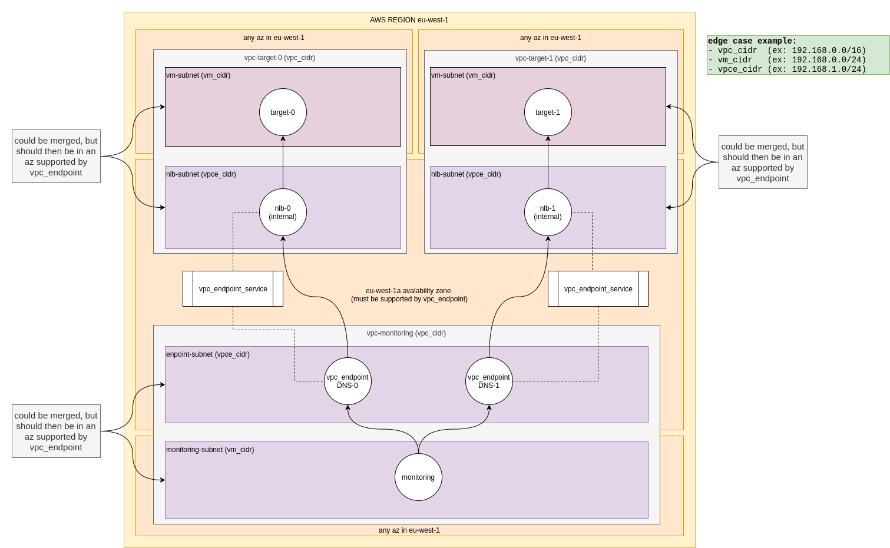

# VPC endpoint demo

what we're able to achieve : SSH connection from monitoring VM to both target_0 & target_1 VMs even if VPC & Subnets CIDR overlap.

NB : these CIDRs actually don't have to overlap, we're displaying an edge case were they do.

## diagram of the demo


## apply
add your ssh public key in a `terraform.tfvars` file like so : 

```
pub_key = "<your_public_key>"
```

```
terraform apply
```

### output 
should look like this

```
monitoring_public_ip = "<monitoring_public_ip>"
target_0 = tolist([
  {
    "dns_name" = "<from monitoring, you can reach target_0 using this dns name>"
    "hosted_zone_id" = "Z38GZ743OKFT7T"
  },
  {
    "dns_name" = "<you can also use this one>"
    "hosted_zone_id" = "Z38GZ743OKFT7T"
  },
])
target_1 = tolist([
  {
    "dns_name" = "<from monitoring, you can reach target_1 using this dns name>"
    "hosted_zone_id" = "Z38GZ743OKFT7T"
  },
  {
    "dns_name" = "you can also use this one"
    "hosted_zone_id" = "Z38GZ743OKFT7T"
  },
])
target_private_ips = [
  "<target_0_private_ip>",
  "<target_1_private_ip>",
]
```

## test

NB : you may have to wait a minute for the NLBs to be ready.

after applying the terraform code, you should be able to log into target_0 & target_1 using, respectively :

```
ssh -i <path_to_your_private_key> -J admin@<monitoring_public_ip> admin@<dns_name_target_0_endpoint>
```

```
ssh -i <path_to_your_private_key> -J admin@<monitoring_public_ip> admin@<dns_name_target_1_endpoint>
```

you can check the ip address in the hostname matches one of the 2 outputed above


## Endpoint specific infrastructure :

have a look at [./vpc_endpoints.tf](./vpc_endpoints.tf) to see what is actually related to vpc_endpoint (NLB, vpc_endpoint_service, vpc_endpoint )
